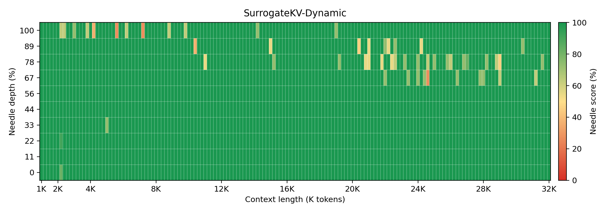
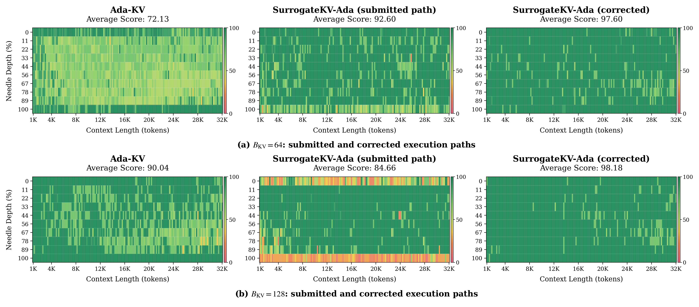

# SurrogateKV

Official implementation and result exports for **SurrogateKV**, a KV-cache
compression method that represents each non-recent cache region as raw KV
tokens, a single surrogate KV pair, or a dropped region under a fixed cache
budget.

SurrogateKV keeps compressed cache entries in the standard KV format, so the
decoder can use ordinary attention after prefill-time cache packing. The same
region-level allocator is used across the SurrogateKV variants, with different
budget/salience profiles for SnapKV-, AdaKV-, and DynamicKV-style settings.

## Highlights

- **Region-level representation choice:** allocates each cache region to raw,
  surrogate, or dropped storage rather than only retaining or evicting tokens.
- **Compact surrogate targets:** replaces selected evicted regions with one
  norm-restored KV prototype.
- **Standard decoding path:** packed raw entries and surrogate entries are both
  ordinary KV pairs.
- **Paper-facing data:** includes compact CSV exports and selected heatmap
  figures used by the paper.

## News

- **July 13, 2026:** Corrected the Mistral NIAH SurrogateKV-Ada evaluation
  dispatch to use the intended per-head cache path. See
  [`CORRECTIONS.md`](CORRECTIONS.md) for the corrected scores and scope.
- The codebase has been cleaned into a standalone paper repository.
- Compact LongBench and Needle-in-a-Haystack experiment data are available
  under `data/`.

## Repository Layout

```text
surrogatekv/
  core.py                # SurKVCluster public runtime entry point
  registry.py            # method registry and aliases
  schedule.py            # layer-budget schedules
  runtime/
    region_allocator.py  # raw / surrogate / drop region allocator
    cache_pipeline.py    # scoring, packing, stats, layout metadata
    prototype_bank.py    # surrogate KV prototype construction
    layer_budget.py      # cross-layer budget coordination
    headwise_runtime.py  # headwise Ada/GQA cache path
    common.py            # shared flags and tensor helpers
run/
  longbench/             # LongBench prediction/evaluation entry points
data/
  longbench/             # compact LongBench CSV exports
  niah/                  # Needle-in-a-Haystack CSV exports
  images/                # selected heatmaps and figures
```

Raw datasets, model weights, full generations, logs, local scratch scripts, and
manuscript sources are intentionally kept outside this repository.

## Installation

```bash
git clone <repo-url> SurrogateKV
cd SurrogateKV
python -m pip install -e .
```

The runtime expects PyTorch and NumPy. Benchmark runners additionally require
the model/evaluation stack used by the experiment workspace, such as
`transformers`, `datasets`, `rouge`, `jieba`, and `fuzzywuzzy`.

Quick import check:

```bash
python - <<'PY'
from surrogatekv import SurKVCluster, SURROGATEKV_METHOD_TO_MODE

print(sorted(SURROGATEKV_METHOD_TO_MODE))
cluster = SurKVCluster(mode="surrogate_kv")
print(cluster.mode)
PY
```

## Supported Methods

| Method name | Internal mode | Description |
| --- | --- | --- |
| `SurrogateKV`, `SurrogateKV-Snap` | `surrogate_kv` | Surrogate allocation with SnapKV-style local scoring. |
| `SurrogateKV-Ada` | `surrogate_kv_ada` | Surrogate allocation with head-adaptive budget use. |
| `SurrogateKV-Dynamic` | `surrogate_kv_dynamic_layer` | Surrogate allocation with layer-adaptive budget use. |

Common lowercase aliases such as `surkv`, `surkv-ada`, and `surkv-dynamic` are
available through `SURROGATEKV_METHOD_TO_MODE`.

## Using the Runtime

`SurKVCluster` is intended to be called from an attention hook or KV-cache
adapter after prefill scores are available.

```python
from surrogatekv import SurKVCluster

cluster = SurKVCluster(
    mode="surrogate_kv",
    window_size=8,
    max_capacity_prompt=512,
    kernel_size=7,
    chunk_size=16,
)

compressed_k, compressed_v = cluster.update_kv(
    key_states,
    query_states,
    value_states,
    attention_mask=None,
    num_key_value_groups=num_key_value_groups,
)
```

`SurrogateKV-Ada` must preserve Ada-KV's head-specific capacities and RAW
selections. Its attention adapter should therefore call the dedicated
head-aware entry point:

```python
ada_cluster = SurKVCluster(
    mode="surrogate_kv_ada",
    window_size=8,
    max_capacity_prompt=512,
    kernel_size=7,
    chunk_size=16,
)

compressed_k, compressed_v = ada_cluster.update_kv_headwise(
    key_states,
    query_states,
    value_states,
    attention_mask=None,
    num_key_value_groups=num_key_value_groups,
)
```

Calling the shared-token `update_kv()` entry point for `surrogate_kv_ada`
raises an error to prevent accidental collapse of the per-head layout.

## LongBench

The LongBench scripts mirror the lightweight entry-point style used by common
KV-cache compression repositories. In this local setup, prediction dispatches to
the surrounding SurKV experiment workspace through `SURKV_WORKSPACE_ROOT`.
Set `LONGBENCH_DATA_DIR` to an external directory containing LongBench JSONL
files.

```bash
export SURKV_WORKSPACE_ROOT=/path/to/SurKV
export LONGBENCH_DATA_DIR=/path/to/LongBench
export MODEL_PATH=/path/to/meta-llama--Meta-Llama-3-8B-Instruct
export METHOD=SurrogateKV
export KV_BUDGETS=128,512
export DATASETS_CSV=qasper,multifieldqa_en,hotpotqa

bash run/longbench/scripts/run_llama/run_llama3_8b_instruct_surkv.sh
```

Evaluate saved predictions:

```bash
python run/longbench/eval.py \
  --results_dir runs/longbench \
  --datasets qasper,multifieldqa_en,hotpotqa \
  --methods SurrogateKV,SurrogateKV-Ada,SurrogateKV-Dynamic
```

## Experiment Data

This repository includes compact CSV exports for representative paper figures
and tables. See `data/README.md` for the exported data groups.

### LongBench, Llama-3-8B-Instruct, KV Budget 512

| Method | Avg | Score vs FullKV |
| --- | ---: | ---: |
| FullKV | 41.92 | 100.00 |
| H2O | 39.68 | 94.65 |
| SnapKV | 40.26 | 96.04 |
| PyramidKV | 40.18 | 95.84 |
| DynamicKV | 40.60 | 96.86 |
| SurrogateKV | 40.88 | 97.52 |

Source CSV:
`data/longbench/llama3_8b_instruct/table1_longbench_k512.csv`

### Needle-in-a-Haystack, Mistral-7B-Instruct-v0.2, KV Budget 128

| Method | NIAH Avg | Examples |
| --- | ---: | ---: |
| SnapKV | 87.51 | 1560 |
| DynamicKV | 98.46 | 1560 |
| Ada-KV | 90.04 | 1560 |
| SurrogateKV-Snap | 98.84 | 1560 |
| SurrogateKV-Ada | 98.18 | 1560 |
| SurrogateKV-Dynamic | 98.74 | 1560 |

Source CSV:
`data/niah/mistral_7b_instruct_v02/k128_ctx1000_32000_step200/niah_average_table.csv`

Selected heatmaps are kept in `data/images/`.



The corrected SurrogateKV-Ada heatmap and a submitted-path/corrected-path
comparison are also available:

[PNG](data/images/mistral_niah_ada_correction_2x3.png) |
[PDF](data/images/mistral_niah_ada_correction_2x3.pdf)



## Development Notes

- Public API and method names live in `surrogatekv/core.py` and
  `surrogatekv/registry.py`.
- Runtime implementation details live under `surrogatekv/runtime/`.
- Add new method aliases through `surrogatekv/registry.py`.
- Keep raw benchmark outputs and local-only workspace tools out of the paper
  repository.

## Citation

BibTeX will be added when the paper metadata is finalized.

## Acknowledgements

This repository follows the evaluation and code-organization conventions of
prior KV-cache compression projects, including SnapKV, H2O, AdaKV, DynamicKV,
and PyramidKV/KVCache-Factory.
