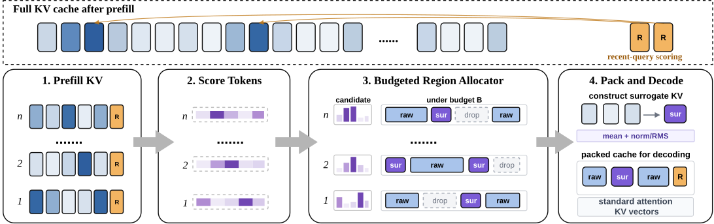
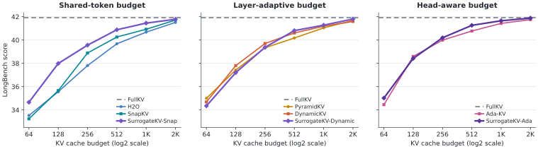

# SurrogateKV

Official implementation and result release for **SurrogateKV:
Representation-Preserving KV Cache Compression for Long-Context LLMs**
(Findings of EMNLP 2026).

Token-level KV compressors ordinarily retain selected entries and discard the
rest. SurrogateKV adds a third representation under the same cache-slot
budget: a contiguous historical region can be replaced by one independently
addressable surrogate KV pair. Salient entries remain exact, admitted regions
become surrogates, and the remaining regions are dropped. The packed cache
contains ordinary KV pairs and uses standard attention during decoding.

SurrogateKV is evaluated on three base compressors. The resulting variants are
SurrogateKV-Snap, SurrogateKV-Dynamic, and SurrogateKV-Ada.

<p align="center">
  <a href="data/images/surrogatekv_overview.pdf">
    
  </a>
</p>

## Contents

- `surrogatekv/`: allocation, surrogate construction, packing, and runtime API
- `run/longbench/`: LongBench wrappers and evaluator
- `data/`: machine-readable values for the paper's tables and figures
- `tests/`: runtime and registry checks
- `scripts/validate_release.py`: consistency checks for released result files

Model weights, benchmark datasets, generated responses, and machine-specific
logs are not included.

## Installation

```bash
git clone https://github.com/kimjunewon/SurrogateKV.git
cd SurrogateKV
python3 -m pip install -e .
```

Python 3.10 or newer is required. Install the LongBench dependencies with:

```bash
python3 -m pip install -e ".[longbench]"
```

The core versions reported for the camera-ready experiments are listed in
[`requirements/paper.txt`](requirements/paper.txt).

## Variants

| Variant | Runtime mode | Base allocation |
| --- | --- | --- |
| `SurrogateKV-Snap` | `surrogate_kv` | SnapKV shared-token selection |
| `SurrogateKV-Dynamic` | `surrogate_kv_dynamic_layer` | DynamicKV layer-wise allocation |
| `SurrogateKV-Ada` | `surrogate_kv_ada` | Ada-KV head-wise allocation |

`SurrogateKV` is an alias of `SurrogateKV-Snap`. Method names and aliases are
available through `SURROGATEKV_METHOD_TO_MODE`.

## Runtime API

The cache adapter calls `SurKVCluster` after prefill attention scores are
available. Tensors use the standard `[batch, heads, sequence, head_dim]`
layout.

```python
from surrogatekv import SurKVCluster

cluster = SurKVCluster(
    mode="surrogate_kv",
    window_size=32,
    max_capacity_prompt=512,
    kernel_size=7,
    chunk_size=16,
)

compressed_k, compressed_v = cluster.update_kv(
    key_states,
    query_states,
    value_states,
    attention_mask=None,
    num_key_value_groups=num_key_value_groups,
)
```

The Ada-KV variant preserves a head-specific cache layout and therefore uses
`update_kv_headwise()` instead of `update_kv()`. Calling the shared-token entry
point in `surrogate_kv_ada` mode raises an error.

## Evaluation

The compact result release and the evaluator are self-contained. The
LongBench prediction wrappers dispatch to the KVCache-Factory adapter used in
the paper, which lives in the companion experiment workspace and is not
vendored into this repository. Set `SURKV_WORKSPACE_ROOT` to a workspace that
contains `tools/run_surkv_longbench.py` and `repos/KVCache-Factory` before
using those wrappers.

```bash
export SURKV_WORKSPACE_ROOT=/path/to/SurKV
export LONGBENCH_DATA_DIR=/path/to/LongBench
export MODEL_PATH=/path/to/Meta-Llama-3-8B-Instruct
export METHOD=SurrogateKV
export KV_BUDGETS=128,512

bash run/longbench/scripts/run_llama/run_llama3_8b_instruct_surkv.sh
```

Saved predictions can be evaluated independently:

```bash
python3 run/longbench/eval.py \
  --results_dir runs/longbench \
  --datasets qasper,multifieldqa_en,hotpotqa \
  --methods SurrogateKV,SurrogateKV-Dynamic,SurrogateKV-Ada
```

See [`docs/REPRODUCIBILITY.md`](docs/REPRODUCIBILITY.md) for the evaluation
scope, reported environment, and released artifacts.

## Results

### LongBench

LLaMA-3-8B-Instruct at `B_KV = 512` (FullKV: 41.92):

| Base allocation | Base | Base score | SurrogateKV variant | Score | Delta |
| --- | --- | ---: | --- | ---: | ---: |
| Shared token | SnapKV | 40.26 | SurrogateKV-Snap | **40.88** | +0.62 |
| Layer-wise | DynamicKV | 40.60 | SurrogateKV-Dynamic | **40.81** | +0.20 |
| Head-wise | Ada-KV | 40.77 | SurrogateKV-Ada | **41.26** | +0.49 |

<p align="center">
  <a href="data/images/longbench_budget_results.pdf">
    
  </a>
</p>

The six-budget curves and per-dataset scores are in
[`data/longbench/llama3_8b_instruct/`](data/longbench/llama3_8b_instruct/).

### Needle-in-a-Haystack

Mistral-7B-Instruct-v0.2 at `B_KV = 128`:

| Base | Base score | SurrogateKV variant | Score |
| --- | ---: | --- | ---: |
| SnapKV | 87.51 | SurrogateKV-Snap | **98.84** |
| DynamicKV | 98.46 | SurrogateKV-Dynamic | **98.74** |
| Ada-KV | 90.04 | SurrogateKV-Ada | **98.18** |

<p align="center">
  <a href="data/images/mistral_niah_k128_method_comparison.pdf">
    
  </a>
</p>

The heatmap grids for `B_KV = 64` and `128` are released under
[`data/niah/`](data/niah/). The head-wise evaluation correction is documented
in [`CORRECTIONS.md`](CORRECTIONS.md).

## Released Data

[`data/README.md`](data/README.md) indexes the CSV files for LongBench, NIAH,
motivation and attention diagnostics, ablations, merging comparisons, serving
efficiency, and model scaling. Run the data checks with:

```bash
python3 scripts/validate_release.py
```

## Development

```bash
python3 -m compileall -q surrogatekv run scripts
python3 -m unittest discover -s tests -v
python3 -m ruff check surrogatekv run tests scripts
```

## Citation

```bibtex
@inproceedings{kim2026surrogatekv,
  title     = {SurrogateKV: Representation-Preserving KV Cache Compression for Long-Context LLMs},
  author    = {Kim, Junwon and Ryu, Junghyun and Talibli, Farid and So, Jungmin and Kim, Youngjae},
  booktitle = {Findings of the Association for Computational Linguistics: EMNLP 2026},
  year      = {2026}
}
```

Machine-readable citation metadata is available in [`CITATION.cff`](CITATION.cff).

## License and Acknowledgements

SurrogateKV is released under the [Apache License 2.0](LICENSE). The runtime
and evaluation interfaces were developed with reference to the official
implementations of [SnapKV](https://github.com/FasterDecoding/SnapKV),
[PyramidKV/KVCache-Factory](https://github.com/Zefan-Cai/KVCache-Factory), and
[AdaKV](https://github.com/FFY0/AdaKV). The paper also evaluates or discusses
[H2O](https://github.com/FMInference/H2O),
[DynamicKV](https://github.com/DreamMr/DynamicKV), and
[D2O](https://github.com/AIoT-MLSys-Lab/D2O).
Third-party license notices are collected in
[`THIRD_PARTY_LICENSES.md`](THIRD_PARTY_LICENSES.md).
